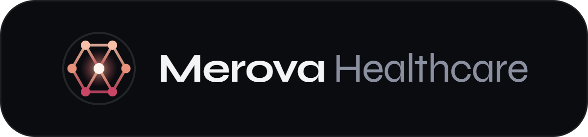

<p align="center">
  
</p>

<h1 align="center">Merova Healthcare — Investor Site</h1>

<p align="center">
  <em>Pharmaceutical manufacturers, acquired one by one and run as one platform.</em>
</p>

<p align="center">
  <a href="https://merova-project-2.vercel.app/" target="_blank" rel="noopener noreferrer">
    
  </a>
</p>

<p align="center">
  
  
  
  
  
</p>

---

## What this is

The investor-facing site for **Merova Healthcare**, a fictional holding company that acquires and scales
pharmaceutical manufacturers across **generics**, **contract manufacturing (CMO)** and **specialty products**.

> 🔗 **[merova-project-2.vercel.app](https://merova-project-2.vercel.app/)** is this exact repository, deployed as-is.
>
> No backend, no database, no API keys. Every company, person and figure is invented, and the contact form
> only simulates sending.

## Getting started

```bash
npm install
npm run dev
```

Open **http://localhost:3000**. No `.env` file, no setup.

```bash
npm run build          # production build (runs the TypeScript check)
npm start               # serve the production build
```

## What's in the box

- **Scroll-scrubbed hero, drawn live** — scrolling plays a scene where isolated manufacturers are acquired,
  pulled together and locked into one glowing sphere. Scroll back and it reverses. It's rendered on a
  canvas from scroll progress, so there are **no images or video**: the whole page is ~420 KB and stays
  sharp on any screen.
- **Interactive platform** — hover a vertical and its band of the sphere lights up.
- **Charts built from the site's own numbers** — market size, portfolio map by real coordinates, CMO
  capacity, investment timeline and returns. No charting library.
- **Pinned horizontal thesis** — five panels scrubbed sideways on desktop, stacked on phones.
- **Accessible** — real text everywhere, and `prefers-reduced-motion` turns off pinning and animation.

## Design

Colour always means a vertical: **coral** is Generics, **burgundy** is CMO, **peach** is Specialty, and
**slate** is an independent manufacturer. All of it comes from one file, `lib/verticals.ts`.
The logo is the platform sphere reduced to seven nodes. Type: **Syne** (display), **Inter** (text),
**Geist Mono** (labels and figures).

## Structure

```
app/            layout, page, theme tokens, favicon
components/
  sections/     one file per section (hero, platform, thesis, market, portfolio, …)
  ui/           Navbar, Logo, SectionHeader, Exhibit
lib/
  hero-scene.ts scene generator + canvas renderer (hero and platform explorer)
  verticals.ts  the three verticals and their colours
  portfolio.ts  portfolio companies, coordinates and headquarters
```

## Honest trade-offs

- The canvas renders on the main thread; it lowers its own resolution if a device can't keep up.
- Pinning the hero for three screens is a showcase choice — shorten it (`h-[400svh]`) on a content-heavy page.
- The portfolio map is a coordinate plot, not a basemap: no coastlines, no map tiles.
- The contact form doesn't send anything; replace `handleSubmit` in `ContactSection.tsx` to connect one.
- No automated tests yet — verified with type-checking, production builds and a headless-browser pass.
